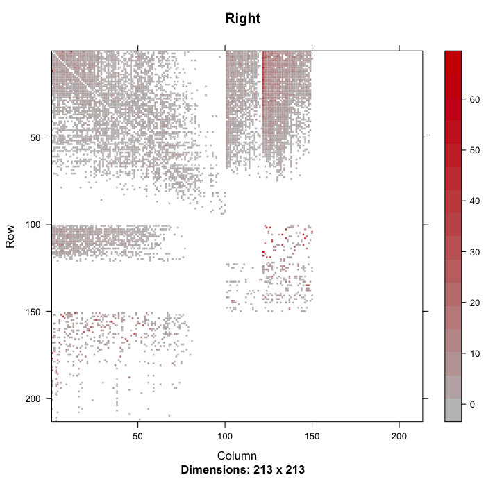
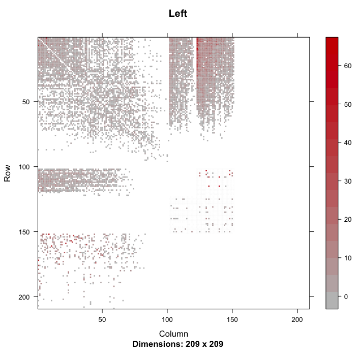
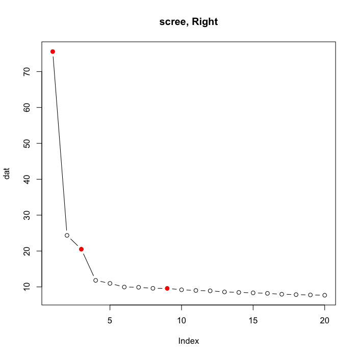
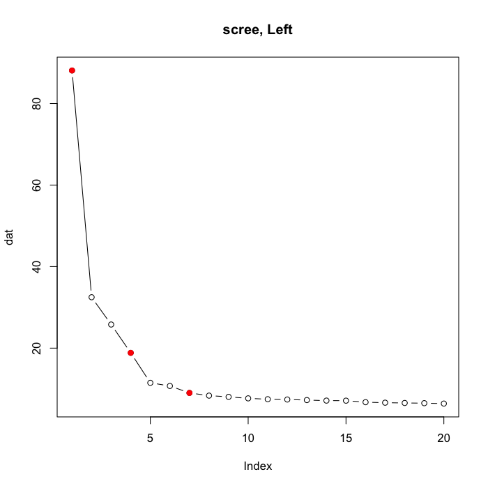
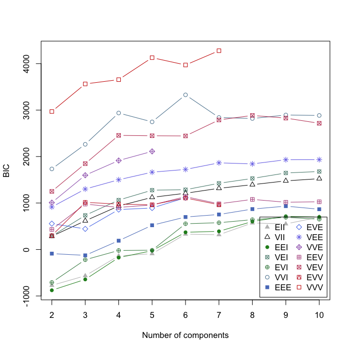
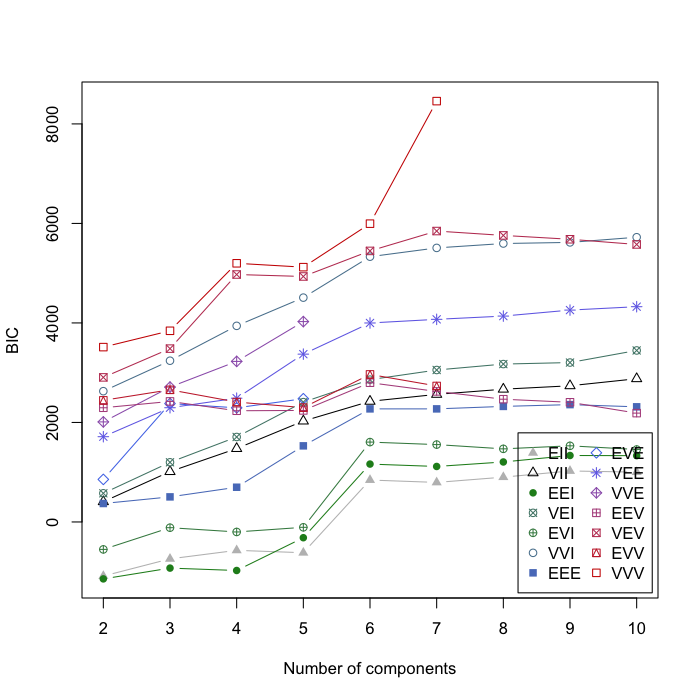

<style type="text/css">
.table {
    width: 40%;
}
</style>


# Data


```r
library(igraph)
library(Matrix)
print(load(url("http://www.cis.jhu.edu/~parky/weightedMB.Rbin")))
```

```
# [1] "wg.R" "wg.L"
```

```r
summary(wg.R$g); image(wg.R$g[], useAbs=FALSE, main="Right")
```

```
# IGRAPH b8d1f90 DNWB 213 7536 -- 
# + attr: name (v/c), type (v/c), claw (v/n), dist (v/n), weight
# | (e/n)
```

<!-- -->

```r
summary(wg.L$g); image(wg.L$g[], useAbs=FALSE, main="Left")
```

```
# IGRAPH 462dff7 DNWB 209 9045 -- 
# + attr: name (v/c), type (v/c), claw (v/n), dist (v/n), weight
# | (e/n)
```

<!-- -->

```r
head(wg.R$vdf)
```


v                                                  type    claw        dist  age    
-------------------------------------------------  -----  -----  ----------  -------
Thermo KC A_Right - Mushroom Body  Left #4229950   KC         2    337.6380  mature 
KC12 #4230061                                      KC         1      0.0000  mature 
KC10 #4227304                                      KC         1   1291.2036  mature 
KC42 #8066542                                      KC         1    252.6335  mature 
KC16 #4415241                                      KC         2   1822.2952  mature 
KC100 #11813287                                    KC         2   1031.6460  mature 

```r
head(wg.L$vdf)
```


v                                            type    claw        dist  age    
-------------------------------------------  -----  -----  ----------  -------
Thermo KC B_left - mbi2 - unknown #7187384   KC         3      0.0000  mature 
KC no pair #4412036                          KC         1   3616.7576  mature 
KC65;_42a left #5937084                      KC         1   1691.4363  mature 
KC42 #11725803                               KC         1   1921.1573  mature 
LON KC left #8262372                         KC         3   2398.7528  mature 
KC13 #14898816                               KC         1    970.6179  mature 

```r
# Alter graphs
A.R <- wg.R$g[]; dim(A.R)
```

```
# [1] 213 213
```

```r
A.L <- wg.L$g[]; dim(A.L)
```

```
# [1] 209 209
```

```r
sum(diag(A.R)); diag(A.R) <- 0
```

```
# [1] 0
```

```r
sum(diag(A.L)); diag(A.L) <- 0
```

```
# [1] 0
```

```r
g.R <- graph.adjacency(A.R, weighted=TRUE); summary(g.R)
```

```
# IGRAPH 4740778 DNW- 213 7536 -- 
# + attr: name (v/c), weight (e/n)
```

```r
g.L <- graph.adjacency(A.L, weighted=TRUE); summary(g.L)
```

```
# IGRAPH ea47767 DNW- 209 9045 -- 
# + attr: name (v/c), weight (e/n)
```

# PTR


```r
W.R <- E(g.R)$weight
E(g.R)$weight <- rank(W.R)*2 / (ecount(g.R)+1)
summary(E(g.R)$weight)
```

      Min.     1st Qu.      Median   Mean    3rd Qu.       Max.
----------  ----------  ----------  -----  ---------  ---------
 0.3578347   0.3578347   0.9181372      1   1.474194   1.999735

```r
W.L <- E(g.L)$weight
E(g.L)$weight <- rank(W.L)*2 / (ecount(g.L)+1)
summary(E(g.L)$weight)
```

     Min.    1st Qu.     Median   Mean    3rd Qu.       Max.
---------  ---------  ---------  -----  ---------  ---------
 0.299801   0.299801   1.045324      1   1.508733   1.999779

# ASE

```r
is.connected(g.R)
```

```
# [1] TRUE
```

```r
is.connected(g.L)
```

```
# [1] TRUE
```

```r
dmax <- 20
ase.R <- embed_adjacency_matrix(g.R, dmax)
ase.L <- embed_adjacency_matrix(g.L, dmax)
(elbow.R <- getElbows(ase.R$D, main="scree, Right"))
```

<!-- -->

```
# [1] 1 3 9
```

```r
(elbow.L <- getElbows(ase.L$D, main="scree, Left"))
```

<!-- -->

```
# [1] 1 4 7
```

```r
dhat.R <- elbow.R[2]
Xhat.R <- cbind(ase.R$X[,1:dhat.R], ase.R$Y[,1:dhat.R])
dhat.L <- elbow.L[2]
Xhat.L <- cbind(ase.L$X[,1:dhat.L], ase.L$Y[,1:dhat.L])
```

# GMM

```r
library(mclust)

Kmax <- 10
mc.R <- Mclust(Xhat.R, 2:Kmax, verbose = FALSE)
mc.L <- Mclust(Xhat.L, 2:Kmax, verbose = FALSE)

plot(mc.R, "BIC")
```

<!-- -->

```r
plot(mc.L, "BIC")
```

<!-- -->

```r
table(wg.R$vdf$type, mc.R$class)
```


/        1    2    3    4    5    6    7
-----  ---  ---  ---  ---  ---  ---  ---
KC      26   45   14   12    0    0    3
MBIN     0    0    3    0    2   16    0
MBON     0    0    1    0   28    0    0
PN       0    0    0    0    0    0   63

```r
adjustedRandIndex(wg.R$vdf$type, mc.R$class)
```

```
# [1] 0.5641981
```

```r
table(wg.L$vdf$type, mc.L$class)
```


/        1    2    3    4    5    6    7
-----  ---  ---  ---  ---  ---  ---  ---
KC      28   47   11   13    0    0    2
MBIN     0    0    0    0   21    0    0
MBON     0    0    0    0   10   19    0
PN       0    0    0    0    0    0   58

```r
adjustedRandIndex(wg.L$vdf$type, mc.L$class)
```

```
# [1] 0.5393392
```
