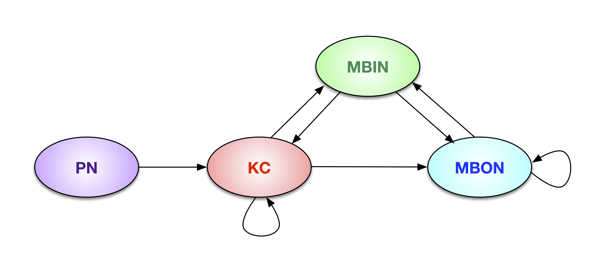

```{r setup, include=FALSE, results='asis'}
library(knitr)
knitr::opts_chunk$set(echo=TRUE, eval=FALSE,warning=FALSE)

opts_knit$set(aliases=c(h='fig.height', w='fig.width', cap='fig.cap', scap='fig.scap'))                                                                               
opts_knit$set(eval.after = c('fig.cap','fig.scap'))                                                                            
knit_hooks$set(document = function(x) {                                                                                        
          gsub('(\\\\end\\{knitrout\\}[\n]+)', '\\1\\\\noindent ', x)                                                                  
          })

 fn = local({
   i = 0
   function(x) {
     i <<- i + 1
#     paste('Figure ', i, ': ', x, sep = '')
     paste('', '', x, sep = '')
   }
 })


suppressMessages(library(ggplot2))
suppressMessages(library(igraph))
suppressMessages(library(Matrix))
suppressMessages(library(lattice))
suppressMessages(library(mclust))
suppressMessages(library(RColorBrewer))
suppressMessages(library(packcircles))
suppressMessages(library(mvtnorm))
suppressMessages(library(printr))
suppressMessages(library(xtable))

```

**[Department of Applied Mathematics and Statistics](http://engineering.jhu.edu/ams/)**      
**[Center for Imaging Science](http://www.cis.jhu.edu)**  
**[Human Language Technology Center of Excellence](http://hltcoe.jhu.edu)**  
**[Johns Hopkins University](http://www.jhu.edu)**  
and  
**[University of Cincinnati](http://business.uc.edu)**  
and  
**[HHMI Janelia Research Campus](hhmi.org)**  

-----

> C.E. Priebe,  Y. Park, M. Tang, A, Athreya, V. Lyzinski, J. Vogelstein,
Y. Qin, B. Cocanougher, K. Eichler, M. Zlatic, A. Cardona,
"[Semiparametric spectral modeling of the Drosophila connectome](http://arxiv.org/abs/1502.03391)," _Journal of the American Statistical Association Application and Case Studies_, submitted, 2017.


# Abstract

We present semiparametric spectral modeling of the complete larval Drosophila mushroom body connectome. Motivated by a thorough exploratory data analysis of the network via Gaussian mixture modeling (GMM) in the adjacency spectral embedding (ASE) representation space, we introduce the stochastic structure model (SSM) for network modeling and inference. SSM is a generalization of the stochastic block model (SBM) and a special case of the random dot product graph (RDPG) latent position model, and is amenable to semiparametric GMM in the ASE representation space. The resulting connectome code derived via semiparametric GMM composed with ASE captures latent connectome structure and elucidates biologically relevant neuronal properties.

> **Keywords**: Connectome; Network; Graph; Spectral embedding; Mixture model; Clustering

<figure>

  <figcaption>Illustration of the larval Drosophila mushroom body connectome as a directed graph on four neuron types.</figcaption>
</figure>

# Data

HHMI Janelia recently reconstructed the complete wiring diagram of the higher order parallel fiber system for associative learning in the larval Drosophila brain, the mushroom body (MB). Memories are thought to be stored as functional and structural changes in connections between neurons, but the complete circuit architecture of a higher-order learning center involved in memory formation or storage has not been known in any organism ... until now. This data set provides a real and important example for initial investigation into synapse-level structural connectome modeling.  

Our MB connectome was obtained via serial section transmission electron microscopy of an entire larval Drosophila nervous system. This connectome contains the entirety of MB intrinsic neurons called Kenyon cells and all of their pre- and post-synaptic partners.

The data, both right and left MB connectomes as well as their meta information, are included in this `R` package and can be loaded into `R` via `data(MBconnectome)`. See below demos for the details.

# Codes and Demos

To run the experiemnts in the paper, please follow these steps.  
(NB: All the codes are in the `demo` folder at [github](https://github.com/youngser/mbstructure).)

## `R` Package

The latest `R` source package can be installed via:
```{r echo=TRUE,eval=FALSE}
install.packages("http://www.cis.jhu.edu/~parky/MBstructure/mbstructure_0.1.0.tar.gz",type="source",method="wget")
```

or through `github`:

```{r echo=TRUE}
require(devtools)
devtools::install_github("youngser/mbstructure")
```

## Demos

To reproduce most of the Figures and Tables in the manuscript, please follow these steps:

```{r demo, eval=FALSE}
library(mbstructure)

# Figure 2 in Section 2
demo(sec2)

# Figures 3, 5, 6, 7 and Tables 1 & 7 in Section 3
demo(sec3)

# Figures 8, 9, 10, 11, 12, 13 in Section 4
demo(sec4) # Warning: This takes several minutes to run on my laptop!

# Figure 14 in Section 5.1.1
demo(sec511) # Warning: This takes about half an hour to run on my laptop!

# Figure 15 in Section 5.1.2
demo(sec512) # Warning: This takes a few minutes to run on my laptop!

# Figure 16 in Section 5.1.4
demo(sec514) # Warning: This takes a few minutes to run on my laptop!
```

The outputs of the demos are here:

* [Section 2](http://www.cis.jhu.edu/~parky/MBstructure/demo/sec2.html)
* [Section 3](http://www.cis.jhu.edu/~parky/MBstructure/demo/sec3.html)
* [Section 4](http://www.cis.jhu.edu/~parky/MBstructure/demo/sec4.html)
* [Section 5.1.1](http://www.cis.jhu.edu/~parky/MBstructure/demo/sec511.html)
* [Section 5.1.2](http://www.cis.jhu.edu/~parky/MBstructure/demo/sec512.html)
* [Section 5.1.4](http://www.cis.jhu.edu/~parky/MBstructure/demo/sec514.html)

# Software and Hardware Information

```{r vn,echo=TRUE, eval=TRUE}
library(help='mbstructure')
sessionInfo()
```

-----
*prepared by <youngser@jhu.edu> on `r date()`*
